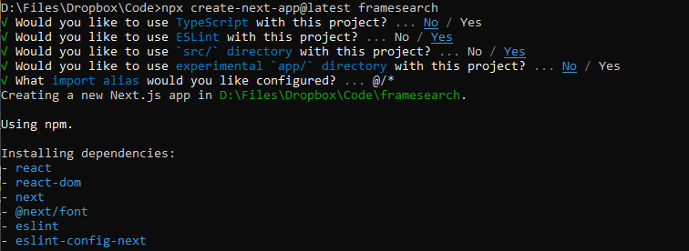

# ShotFinder
> App for storing and searching movie frames.

![License][license-image]  ![Stars][stars-image]

App for storing and searching movie frames.



## Development setup

#### Recommended Tools:
- Node.js v18.14.0

First, run the development server:

```bash
npm run dev
# or
yarn dev
# or
pnpm dev
```

Open [http://localhost:3000](http://localhost:3000) with your browser to see the result.

[API routes](https://nextjs.org/docs/api-routes/introduction) can be accessed on [http://localhost:3000/api/hello](http://localhost:3000/api/hello). This endpoint can be edited in `pages/api/hello.js`.

The `pages/api` directory is mapped to `/api/*`. Files in this directory are treated as [API routes](https://nextjs.org/docs/api-routes/introduction) instead of React pages.

This project uses [`next/font`](https://nextjs.org/docs/basic-features/font-optimization) to automatically optimize and load Inter, a custom Google Font.


## Release History

* 0.1.0
  * Initial build


<!-- Markdown link & img dfn's -->
[license-image]: https://img.shields.io/github/license/colbehr/shotfinder?style=for-the-badge
[stars-image]: https://img.shields.io/github/stars/colbehr/shotfinder?style=for-the-badge


