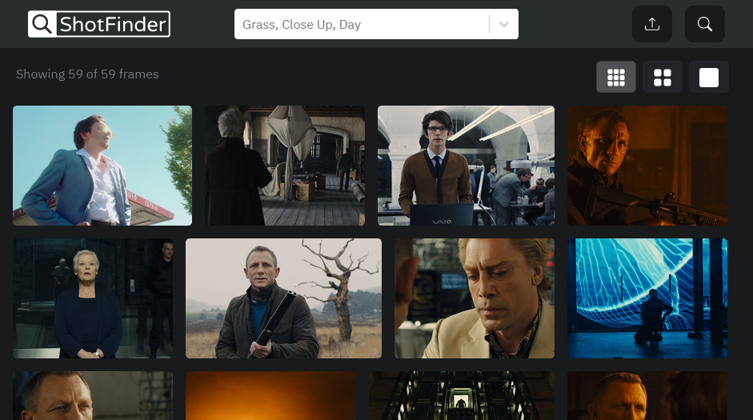

# ShotFinder
> ShotFinder is an React.js app that allows you to store and organize frames from your favorite movies. With its user-friendly interface and advanced filtering and search capabilities, finding that perfect shot has never been easier. Simply add frames to your collection and categorize them by film, scene, or any other criteria you choose. Then, use the app's powerful search functions to quickly find the shots you need. Whether you're a filmmaker, film enthusiast, or just looking for a way to save and recall your favorite movie moments, ShotFinder is the perfect tool for you. So start building your collection today and never miss a shot!

![License][license-image]  ![Stars][stars-image]

ShotFinder also allows you to upload and categorize your own movies, giving you complete control over your collection. With the ability to self-host and store your data locally, you can be sure that your movie frames are always accessible and secure. 



## Development setup

#### Recommended Tools:
- Node.js v18.14.0

First, run the development server:

```bash
npm run dev
# or
yarn dev
# or
pnpm dev
```

Open [http://localhost:3000](http://localhost:3000) with your browser to see the result.


## Release History

* 0.1.0
  * Initial build
  * Initial Nav
  * Basic Content Rendering
  * Infinite Scroll
  * Search with multiple tags
  * Basic Upload with images
  * Basic Tagging
  * Basic Single Page
  
## Next Steps
  * Improve upload to include some auto tagging
  * Dockerize
  * Profiles + Collections
  

<!-- Markdown link & img dfn's -->
[license-image]: https://img.shields.io/github/license/colbehr/shotfinder?style=for-the-badge
[stars-image]: https://img.shields.io/github/stars/colbehr/shotfinder?style=for-the-badge


